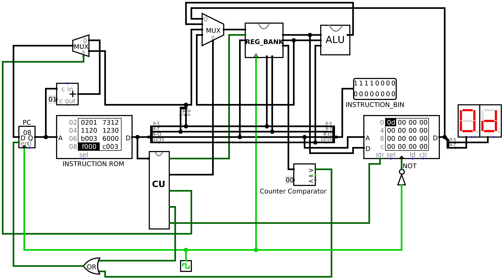
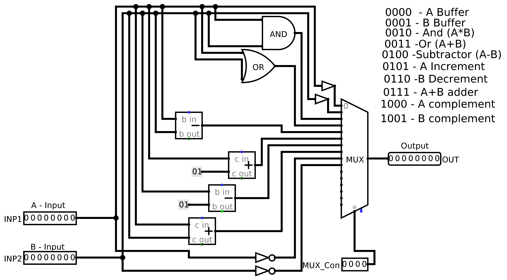
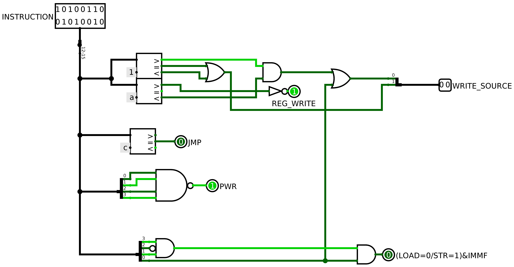
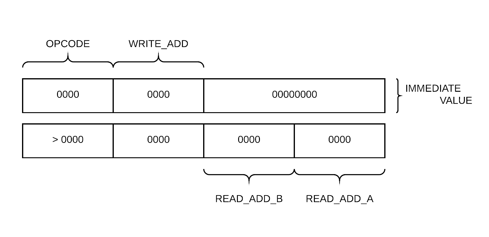

# 8bit Computer

Developed by Hatim Nomani(@hatimmnomani) and Mihir Srivastava(@msriv)

Our project for the course Computer Architecture, the following is the working and specification of this 8-bit Computer. 

The CPU is shown below. It consists of all the necessary components required by any CPU. This simulation is done on Logisim.

We will cover the necessary component specification below. 

1. **Arithmetic Logic Unit**

The unit that controls all the logical and arithmetic operations. 

The codes written along the ALU are the inputs in the `MUX_Con` . 

| MUX_Con Address | Description |
| :-------------: | :---------: |
|      0000       |  A Buffer   |
|      0001       |  B Buffer   |
|      0010       |   A AND B   |
|      0011       |   A OR B    |
|      0100       |     A-B     |
|      0101       |     A++     |
|      0110       |     B--     |
|      0111       |     A+B     |
|      1000       |     !A      |
|      1001       |     !B      |

1. **Register Bank**

This is 8-bit x 16 register, Register Bank. It consists of 16 Registers which store values whenever the clock is triggered. The `WRITE_MODE` trigger is to switch write mode on and off, so we don't have the problem of erasing the data already existing in the register bank. `WRITE_IN_ADDRESS` is the address of the register where data needs to be written. `OUT_ADDRESS 1` and`OUT_ADDRESS 2` are the addresses of the two operands we will require from the register bank.  

1. **Control Unit**

The Control Unit just uses the opcode to determine which flags to turn on or off and the `WRITE_SOURCE` control line as visible in the diagram above. The `REG_WRITE` controls the `WRITE_MODE` in the Register Bank. The `JMP` controls the instruction to which we need to jump. The `PWR` flag controls the Program Counter and stops the increment cycle so that no more instructions can be read.

The instruction is a group of 16-bit binary which is segmented into the following format, 

|   OPCODE    |                         Description                          |
| :---------: | :----------------------------------------------------------: |
|    0000     |                       OReg &larr; IMM                        |
|    0001     |                      OReg &larr; REG_B                       |
|    0010     |                 OReg &larr; REG_B AND REG_A                  |
| 0011 - 1001 | Same as 0010 for different ALU operations as mentioned above. |
|    1010     |                   LOAD OReg &larr; MEM[A]                    |
|    1011     |                   STORE OMEM &larr; REG_A                    |
|    1100     |                      PC &larr; JUMP_DES                      |
|    1111     |                             HALT                             |

When the Opcode is 0000, the least significant 8-bits act as an immediate value in the instruction which is written inside a register in the register bank. For all the Opcode other than 0000, the least significant 8-bit are divided into 4-bit pair in which they store the values of addresses of Register B and Register A respectively.  The 4-bits after the opcode are the `WRITE_ADD` where any operation that we are performing is written to.  

### Assembly to Hex

The assembler for this setup is not yet written, but the codes given in the `asmHex` folder contain example Hex codes for this setup.

**Binary to Hex**
For a 16-bit binary, it is divided into 4-bit binary numbers, which then each represents a number and this 4 digit number is a hexadecimal number.

### Example
Addition of two numbers

| ASSEMBLY LANG           | INSTRUCTION      | HEXADECIMAL | Comment                                                      |
| ----------------------- | ---------------- | ----------- | ------------------------------------------------------------ |
| MOV A &larr; 6          | 0000000000000110 | 0006        | We are moving 6 to Register at 0000 address i.e., Register A |
| MOV B &larr; 9          | 0000000100001001 | 0109        | We are moving 9 to Register at 0001 address i.e., Register B |
| ADD REG A + REG B       | 0111001000010000 | 7210        | We are adding values at Register A and Register B and writing the output on Register C i.e., Register at address 0010. |
| STORE OMEM &larr; REG C | 1011000000000010 | b002        | We are storing the output of the sum from Register C to a memory location in the RAM. |
| HALT                    | 1111000000000000 | f000        | HALT state. Machine stops.                                   |

